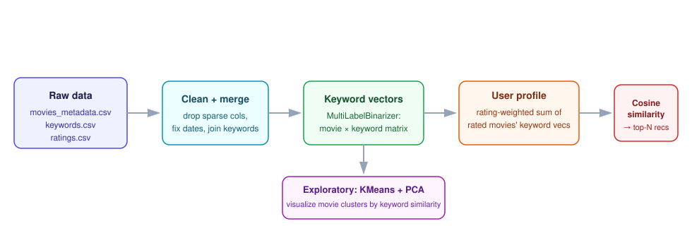

# Movie Recommendation System — Telia Task

**Built:** July 2024

Content-based movie recommender built for a Telia internship take-home task: given a user's past ratings, recommend movies similar in *content* (keywords/themes) rather than relying on other users' behavior — useful when a service has few ratings per user or wants recommendations that don't depend on a large collaborative-filtering user base.

## Approach

<p align="center">
  
</p>

1. **Exploratory data analysis & cleaning** (`telia_movies_task.ipynb`) — inspects the MovieLens-style dataset (movie metadata, keywords, ratings) for missing values and inconsistencies, drops columns with little analytical value (`homepage`, `belongs_to_collection`, `tagline`), and fixes malformed date entries.
2. **Keyword vectorization** (`basic_recommendation_system.ipynb`) — each movie's keyword tags are turned into a multi-hot vector across the full keyword vocabulary using `MultiLabelBinarizer`, giving a movie × keyword matrix.
3. **User profile construction** — a user's profile vector is the rating-weighted average of the keyword vectors of movies they've already rated, so movies sharing themes with highly-rated films contribute more.
4. **Recommendation** — cosine similarity between the user profile and every movie's keyword vector ranks candidates; the top-N unrated movies are returned as recommendations.
5. **Exploratory clustering** — KMeans over the same keyword matrix, visualized in 2D via PCA, to sanity-check that movies cluster sensibly by theme.

## Results

Full results, plots, and commentary (in Lithuanian) are in [`telia_movies_results_presentation_KSilius.pdf`](telia_movies_results_presentation_KSilius.pdf).

## Repo contents

- `telia_movies_task.ipynb` — EDA, cleaning, and dataset analysis
- `basic_recommendation_system.ipynb` — keyword vectorization, user-profile recommender, clustering

## Data

Not committed to the repo (kept it lean instead). The notebooks expect "The Movies Dataset" (search for it on Kaggle) unzipped into `movies_dataset/`, providing `movies_metadata.csv`, `keywords.csv`, and `ratings.csv`. `cleaned_duomenys.csv` and `movies_with_keywords.csv` are intermediate files the notebooks generate from those.

## Usage

```bash
pip install pandas scikit-learn matplotlib
jupyter notebook telia_movies_task.ipynb
```
